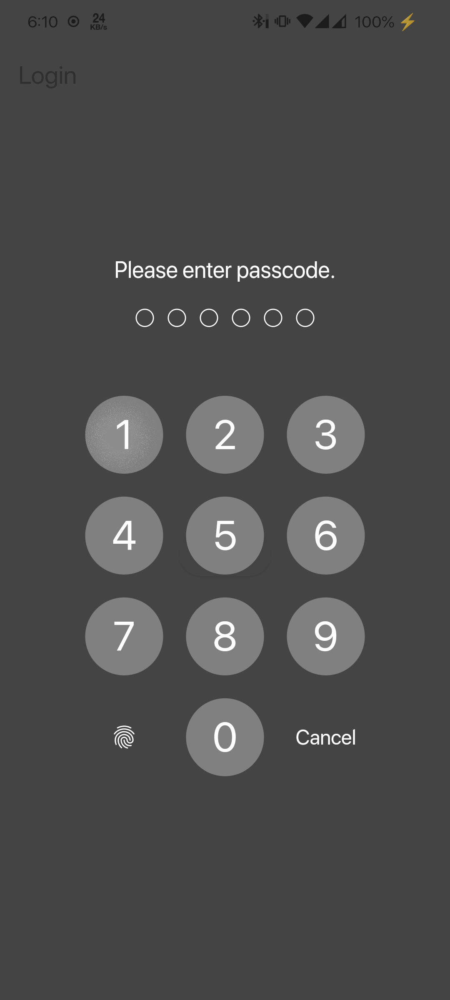
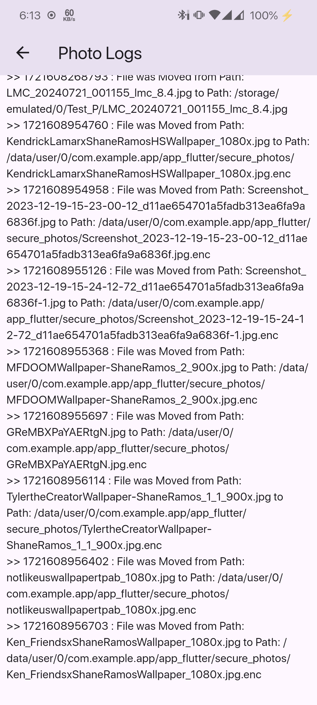

# Secure Photo App

## Overview
This Flutter application provides a secure way to store and manage photos. It uses encryption for storing photos, PIN-based authentication, and supports biometric login.

## Screenshots

<table>
  <tr>
    <td></td>
    <td></td>
    <td></td>
    <td></td>
  </tr>
  <tr>
    <td></td>
    <td></td>
    <td></td>
    <td></td>
  </tr>
</table>

## Architecture

The app follows a BLoC (Business Logic Component) architecture pattern and is structured as follows:

1. **Presentation Layer**
   - Screens: Login, Set PIN, Home, Logs
   - Widgets: Photo options, Image preview

2. **Business Logic Layer**
   - BLoCs: AuthBloc, PhotoBloc

3. **Data Layer**
   - Services: EncryptionService, PhotoService, LoggerService

4. **Domain Layer**
   - Events and States for BLoCs

## Key Features

- Secure photo storage with encryption
- PIN-based authentication
- Biometric (fingerprint) authentication
- Photo management (add, delete, move, share)
- Activity logging

## Libraries and Frameworks

1. **State Management**
   - flutter_bloc: ^8.1.6

2. **Secure Storage**
   - flutter_secure_storage: ^8.0.0
   - hive: ^2.2.3
   - hive_flutter: ^1.1.0

3. **Encryption**
   - encrypt: ^5.0.1

4. **Authentication**
   - local_auth: ^2.2.0
   - flutter_screen_lock: ^9.1.0

5. **File Management**
   - path_provider: ^2.1.3
   - permission_handler: ^11.3.1
   - path: ^1.9.0
   - file_picker: ^8.0.6

6. **Image Picking**
   - wechat_assets_picker: ^9.1.0

7. **Logging**
   - logger: ^2.4.0

8. **Sharing**
   - share: ^2.0.4

9. **Icons**
   - cupertino_icons: ^1.0.6

## Assumptions and Decisions

1. **Storage Location**: The app stores encrypted photos in a secure folder within the app's document directory.

2. **Encryption**: AES encryption is used with a key and IV stored in the device's secure storage.

3. **Authentication**: The app uses a 6-digit PIN for authentication, with an option for biometric authentication.

4. **Photo Selection**: The app uses the `wechat_assets_picker` for selecting multiple photos from the device gallery.

5. **Logging**: The app maintains logs of file access and movement for auditing purposes.

6. **Sharing**: When sharing a photo, the app creates a temporary decrypted copy which is deleted after sharing.

## Setup and Installation

1. Clone the repository
2. Ensure you have Flutter installed and set up on your development machine
3. Run `flutter pub get` to install dependencies
4. Ensure you have set up the necessary permissions in `AndroidManifest.xml` for Android and `Info.plist` for iOS
5. Run the app using `flutter run`

## Security Considerations

- The app uses secure storage for sensitive data like encryption keys and PIN
- Photos are encrypted before storage and decrypted only when needed
- Biometric authentication adds an extra layer of security
- Activity logging helps in auditing and tracking any unauthorized access

## Future Improvements

- Implement remote backup of encrypted photos
- Add option to change PIN
- Implement two-factor authentication
- Add face recognition for iOS devices
- Optimize performance for handling large numbers of photos
